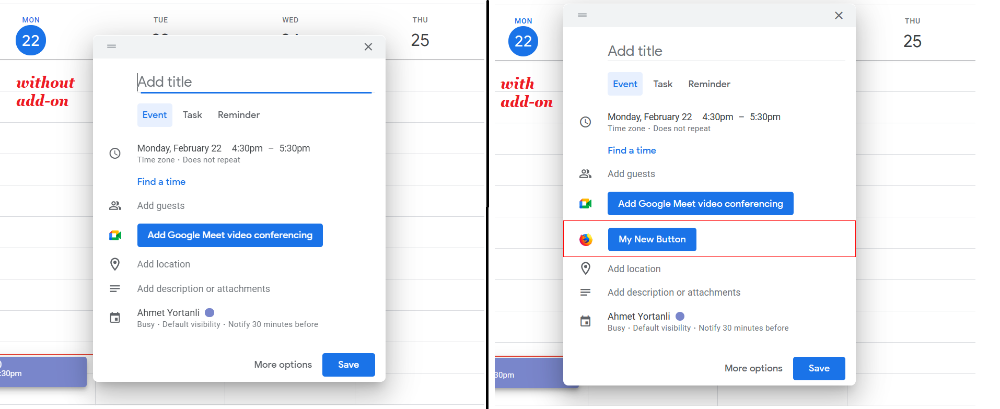

# firefox-plugin-for-google-calendar
A sample firefox plugin for google calendar 

The best way to extend Google workspace applications (like Gmail, Google Calendar, Google Docs, etc.) is to extend Google workspace with [gsuite add-ons](https://developers.google.com/workspace/add-ons/calendar).  

However, gsuite add-ons don't provide a way to manipulate views of applications directly. Instead, it provides an interface to create your own custom views inside an extendable right panel. For example, in the calendar, it is not possible to add a new button to the meeting scheduler view. If you have such a requirement, you should create a browser plugin.  

This project was developed as proof of concept work to show the possibility of editing google calendar views. Although it is possible to modify Calendar views directly, It may not be feasible to provide such a browser add-on to the end-user. Because it is directly dependant on Google workspace dom tree structure. On each Calendar app deployment, your add-on may collapse due to dom-tree structure/attribute changes that your add-on depends on. 

## How to install the add-on to firefox
- run npm task to build the add-on.
    >`npm run build` 
- add-on distribituion is the [plugin](./plugin) folder. Deploy folder as described [here](https://developer.mozilla.org/en-US/docs/Mozilla/Add-ons/WebExtensions/Your_first_WebExtension#installing)
- Result should be like the following:

## Extras

- To help your add-on look and feel like Google Calendar, link in [the Google CSS package](https://ssl.gstatic.com/docs/script/css/add-ons1.css) to apply Google styling to fonts, buttons, and form elements. For more information [click here](https://developers.google.com/workspace/add-ons/guides/css).
